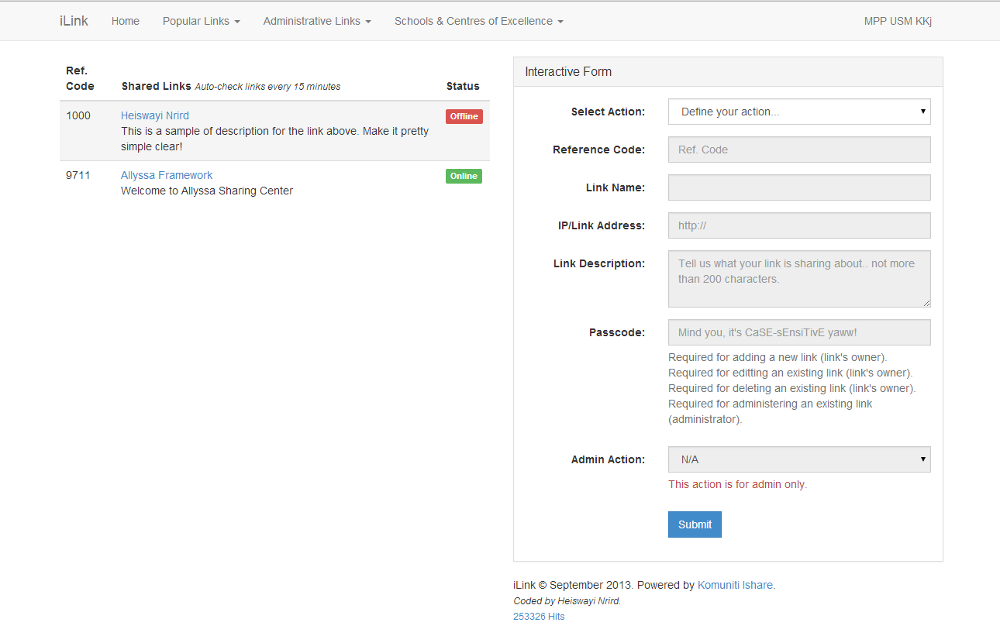

# iLink

iLink is a simple script written in PHP to monitor [HFS](http://www.rejetto.com/hfs/) servers (popularly known as sharerlinks) submitted by sharers (e.g. students) and it is accessible to [Komuniti Ishare](https://www.facebook.com/groups/komuniti.ishare/) only.

iLink is a simplified version of controversial [IsharePortal](ishareportal). Created in September 2013 for students in Universiti Sains Malaysia, Engineering Campus.

## Screenshot

## Features

* Provide HFS servers listing
* Automated checking and monitoring of online-offline status for each submitted sharelinks
* No registration, just a single passcode

## License

Heiswayi Nrird, 2013-2015
