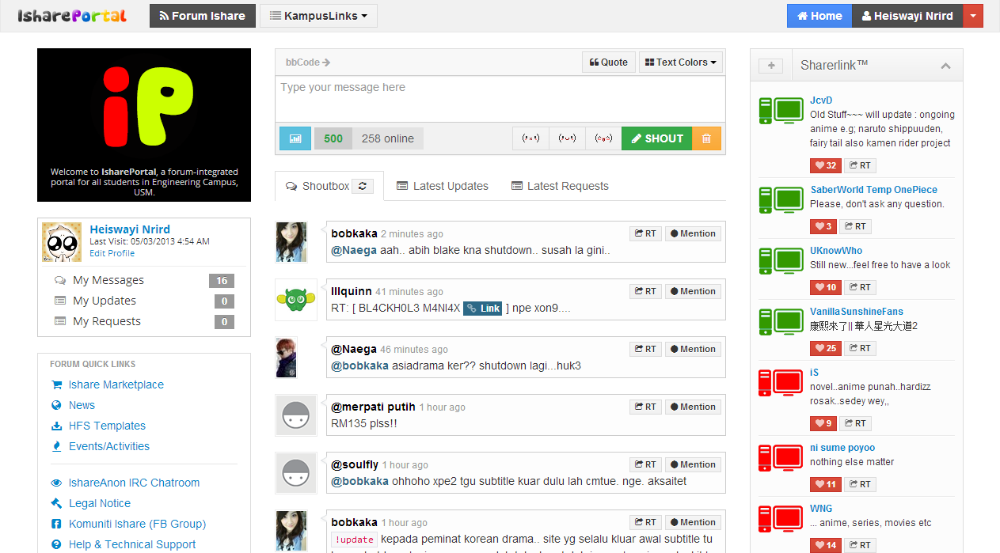
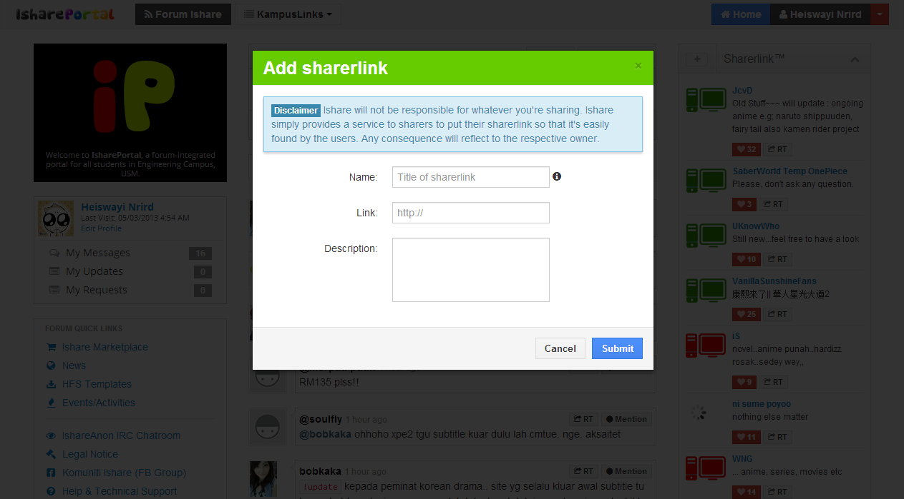
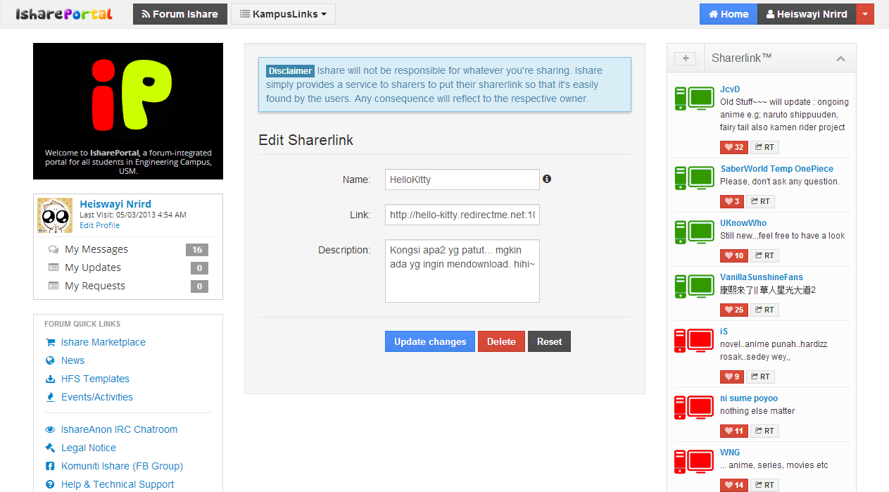
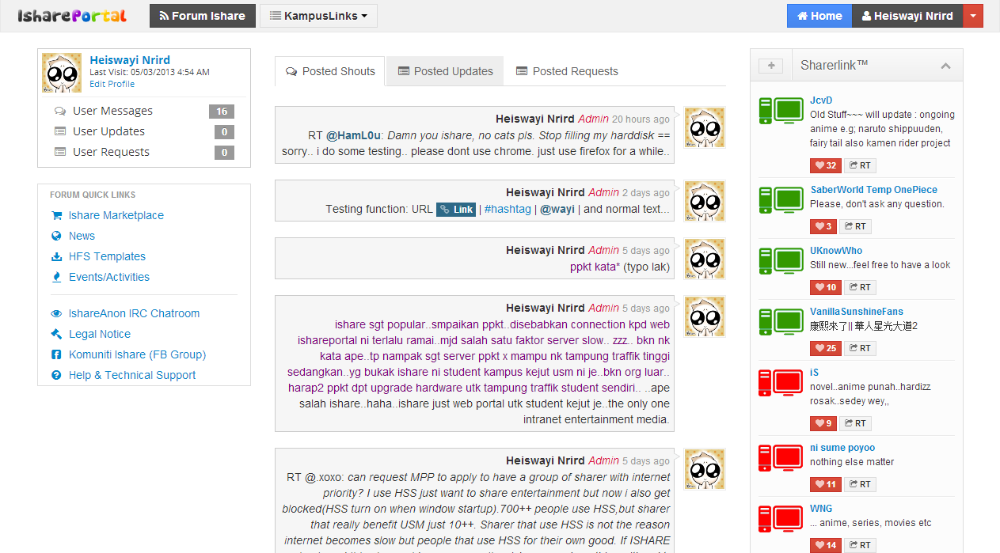
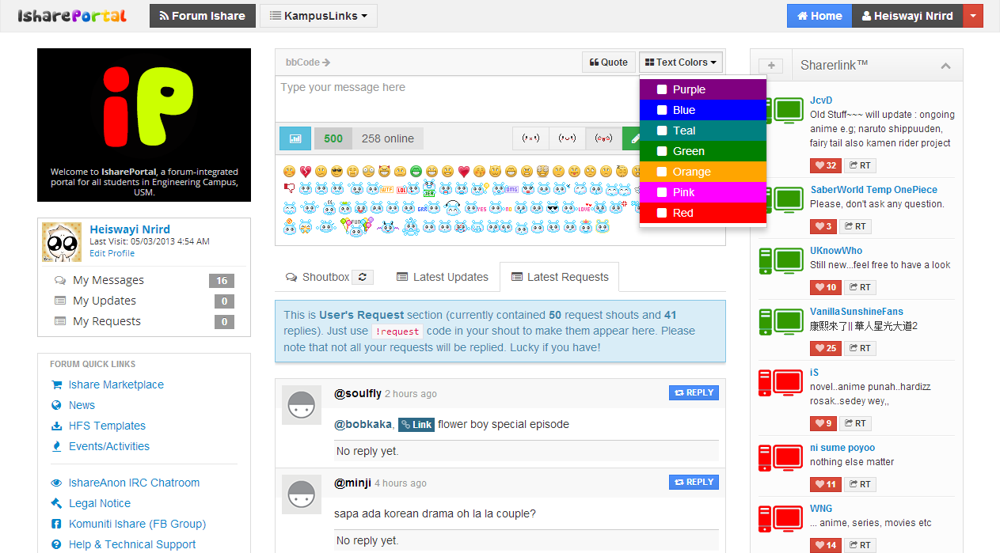
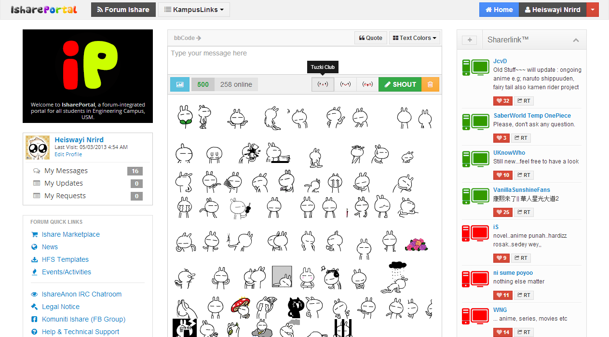
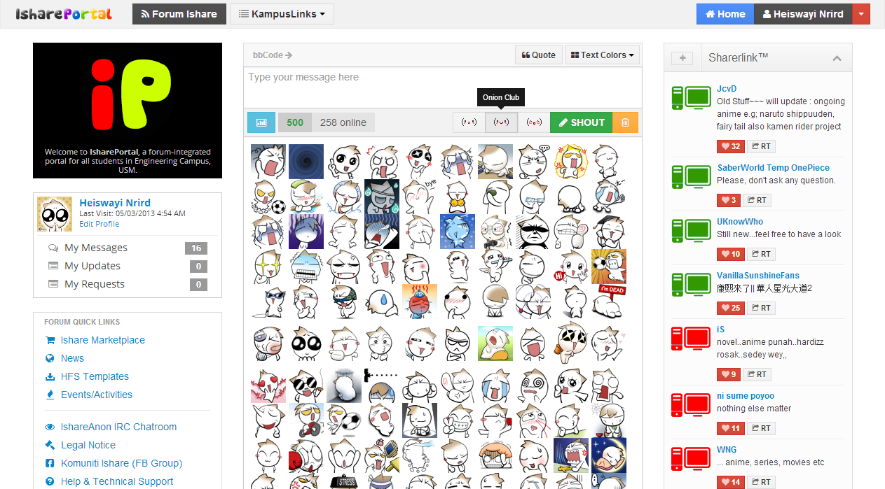

# IsharePortal, 2013

This repository contains the full source code used for IsharePortal, the latest version of a community-based web portal. It is a fully-featured and improved version of [Ishare+](ishare-plus). The project has been discontinued, and the source code may be deprecated.

## Untold history...

IsharePortal was essentially a web platform for a sharing community powered by students at USM Engineering Campus, established in February 2010. Originating from "Ishare," a simple WordPress-based site that aggregated all sharing IP servers (commonly known as sharerlinks) from available sharers (students, staff, lecturers, etc.) and automatically sorted them in one place. This allowed other users/downloaders to easily find the sharerlinks. Ishare began to grow in the number of users and community, prompting me to continuously improve the portal code. Eventually, I decided to create a customized system from scratch using PHP, MySQL, and jQuery. I continued to enhance the code, feature by feature, until we had the best and most-used features that brought value to the community.

1. Fully customized chatbox with a choice of popular, funny, and fun emoticons such as Tuzki and Onion Head Club emoticons.
2. Automated checking of the online-offline status of the sharerlinks/IP address of the sharer's server.

In the end, IsharePortal evolved into a comprehensive CMS featuring a User Profile system and full integration with [PunBB](https://github.com/punbb/punbb) forum board. The included source code of PunBB software is a modified version specifically made to integrate with IsharePortal.

And then, we had our own tagline:

> For Sharers. By Sharers.

### The saddest part: shutdown of IsharePortal operation

Due to its popularity among students and others, the IsharePortal project generated controversies, leading to pros and cons about its continued operation. High traffic within the network (intranet) due to massive bandwidth use and the public sharing of illegal content, such as pirated movies using the university network, were the most highlighted cons by the university administration (known as PPKT). Eventually, I decided to [shut it down on March 12, 2013](ishare-in-memory) effectively.

Due to community requests, even though the main portal was shut down, I created another simple script, calling it a compact version of the sharerlink system known as [iLink](ilink). This allowed sharers to continue promoting their sharerlinks to the community. This script at least reduced high traffic load and made it less obvious on the university administration's radar. I'm not sure if iLink is still running today or not, as I left my university a couple of years ago. I hope someone who administered it can keep operating it and contributing to the community.

## Screenshots

_Screenshot 1_

_Screenshot 2_

_Screenshot 3_

_Screenshot 4_

_Screenshot 5_

_Screenshot 6_

_Screenshot 7_

Heiswayi Nrird, 2010-2013